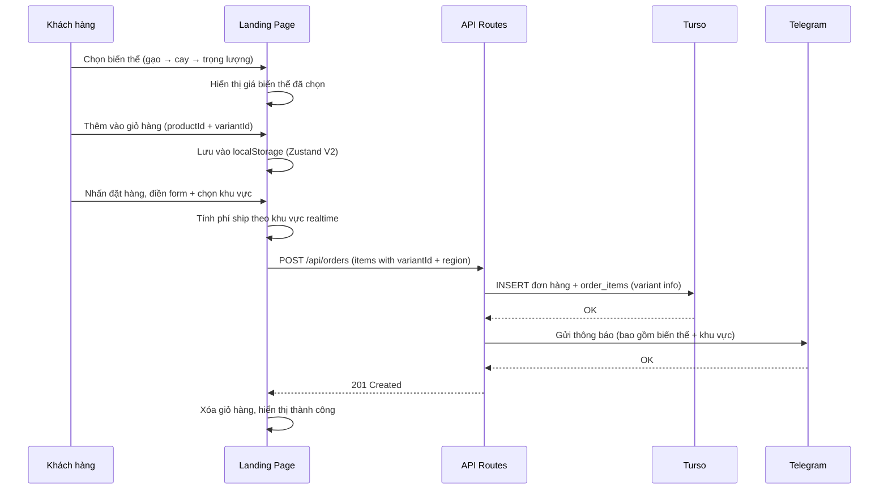
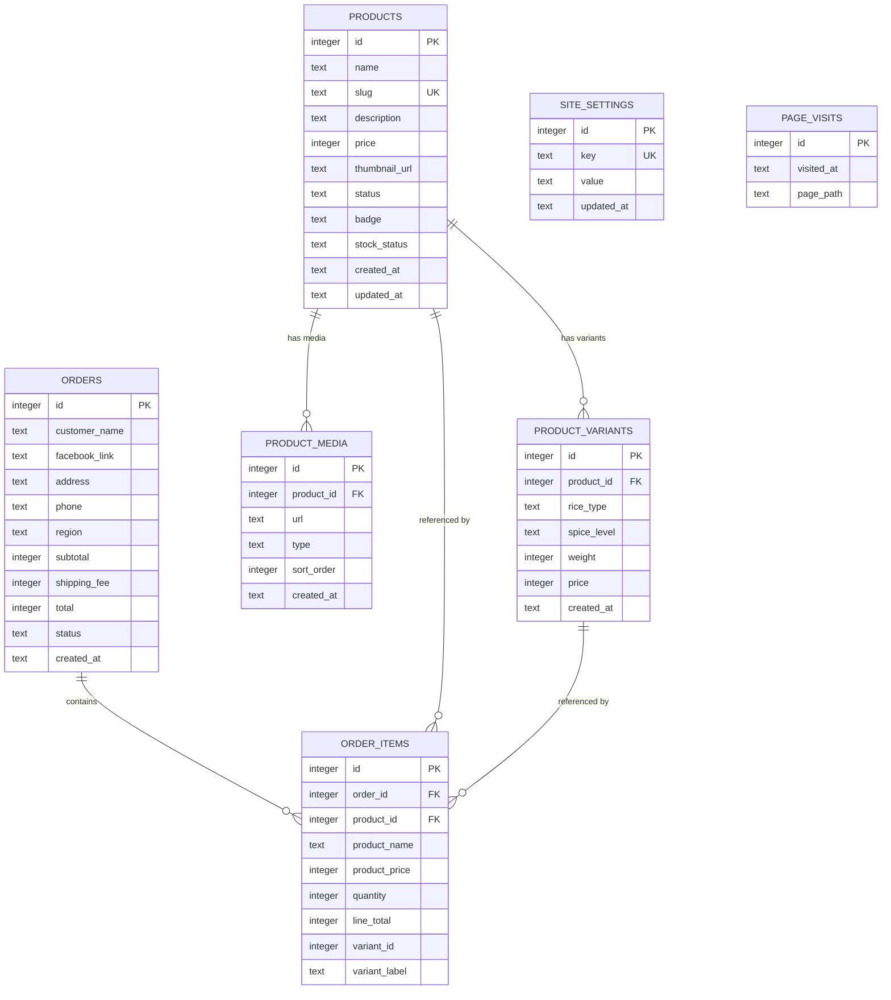

# Tài liệu Thiết kế — Landing Page Bếp Cô Như V2

## Tổng quan

Phiên bản V2 nâng cấp hệ thống Landing Page hiện tại với các thay đổi chính:

1. **Hệ thống biến thể sản phẩm**: Thêm bảng `product_variants` để mỗi sản phẩm có nhiều biến thể (loại gạo, vị cay, trọng lượng) với giá riêng
2. **Phí vận chuyển theo khu vực**: Mở rộng `calculateShippingFee(totalBags, region)` hỗ trợ HCM vs Tỉnh khác
3. **Giỏ hàng V2**: `CartItem` bao gồm thông tin biến thể, key giỏ hàng là `productId + variantId`
4. **Giao diện mới**: Bảng màu cam cháy (#FF6600) / vàng nắng (#FFB800), Hero Section, Sticky Header với hotline, Floating Cart, nhãn sản phẩm
5. **Bộ chọn biến thể đa bước**: Chọn lần lượt loại gạo → vị cay → trọng lượng
6. **Form đặt hàng V2**: Thêm trường khu vực (HCM / Tỉnh khác), tính lại phí ship realtime
7. **Telegram V2**: Bao gồm thông tin biến thể và khu vực trong tin nhắn
8. **Quản lý nội dung trang (CMS)**: Bảng `site_settings` cho hotline, link Zalo/Shopee, banner khuyến mãi
9. **Trạng thái còn hàng / hết hàng**: Toggle in-stock/out-of-stock cho sản phẩm

### Nguyên tắc thiết kế

- **Backward compatible**: Giữ nguyên cấu trúc bảng hiện tại, chỉ thêm cột/bảng mới
- **Incremental migration**: Sản phẩm không có biến thể vẫn hoạt động bình thường (dùng giá gốc từ bảng `products`)
- **Mobile First**: Thiết kế ưu tiên mobile (320px+), mở rộng tốt trên desktop (đến 1920px)

### Công nghệ giữ nguyên

| Thành phần | Công nghệ |
|---|---|
| Framework | Next.js 14 (App Router) |
| Styling | Tailwind CSS |
| Database | Turso (libSQL) + Drizzle ORM |
| Media Storage | Cloudinary |
| Auth | Facebook OAuth (next-auth) |
| Notifications | Telegram Bot API |
| State (client) | Zustand + localStorage |
| Testing | Vitest + fast-check |

## Kiến trúc

### Sơ đồ kiến trúc V2 (thay đổi so với V1)

```mermaid
graph TB
    subgraph "Client — Landing Page"
        HERO[Hero Section]
        HEADER[Sticky Header + Hotline]
        PRODUCTS[Product Cards + Badges]
        VARIANT[Bộ Chọn Biến Thể]
        CART_FLOAT[Floating Cart Icon]
        CART_PAGE[Cart Page V2 — variant info]
        ORDER_FORM[Order Form V2 — region selector]
        CTA[CTA Buttons — Zalo / Shopee]
    end

    subgraph "Client — CMS Dashboard"
        CMS_PRODUCTS[Quản lý SP + Biến thể + Badge + Stock]
        CMS_SETTINGS[Quản lý Nội dung trang]
        CMS_ORDERS[Đơn hàng + Khu vực + Biến thể]
    end

    subgraph "Next.js API Routes"
        API_PRODUCTS["/api/products — V2 includes variants"]
        API_VARIANTS["/api/products/[id]/variants — NEW"]
        API_ORDERS["/api/orders — V2 region + variant"]
        API_SETTINGS["/api/settings — NEW"]
        API_UPLOAD[/api/upload]
        API_STATS[/api/stats]
    end

    subgraph "External Services"
        TURSO[(Turso Database — V2 schema)]
        CLOUDINARY[Cloudinary CDN]
        TG[Telegram Bot API — V2 format]
    end

    HEADER --> API_SETTINGS
    PRODUCTS --> API_PRODUCTS
    VARIANT --> API_PRODUCTS
    ORDER_FORM --> API_ORDERS
    CTA --> API_SETTINGS
    CMS_PRODUCTS --> API_PRODUCTS
    CMS_PRODUCTS --> API_VARIANTS
    CMS_SETTINGS --> API_SETTINGS
    CMS_ORDERS --> API_ORDERS

    API_PRODUCTS --> TURSO
    API_VARIANTS --> TURSO
    API_ORDERS --> TURSO
    API_ORDERS --> TG
    API_SETTINGS --> TURSO
    API_UPLOAD --> CLOUDINARY
```

### Luồng đặt hàng V2



## Thành phần và Giao diện

### 1. Thay đổi Landing Page

#### Cấu trúc trang (giữ nguyên routes, thay đổi nội dung)

| Route | Thay đổi V2 |
|---|---|
| `/` | Thêm Hero Section, ProductCard V2 (badges, khoảng giá), CTA buttons, Floating Cart |
| `/san-pham/[slug]` | Thêm Bộ Chọn Biến Thể, hiển thị giá theo biến thể, trạng thái hết hàng |
| `/gio-hang` | Hiển thị thông tin biến thể cho mỗi dòng, key = productId+variantId |
| `/dat-hang` | Thêm trường khu vực (HCM/Tỉnh khác), tính phí ship realtime |

#### Components mới

- **`HeroSection`**: Banner lớn đầu trang với hình ảnh sản phẩm nổi bật, slogan "Giòn Rụm Từng Hạt - Đậm Đà Vị Quê", nút CTA
- **`VariantSelector`**: Bộ chọn biến thể đa bước (loại gạo → vị cay → trọng lượng). Tự động bỏ qua bước nếu chỉ có 1 giá trị. Disable nút "Thêm giỏ hàng" khi chưa chọn xong
- **`FloatingCart`**: Icon giỏ hàng cố định góc dưới phải, badge số lượng, link đến `/gio-hang`
- **`RegionSelector`**: Dropdown chọn khu vực (HCM / Tỉnh khác) trong form đặt hàng
- **`ProductBadge`**: Nhãn hiển thị trên góc thẻ sản phẩm ("Best Seller", "Bán chạy", "Yêu thích")
- **`PromoBanner`**: Banner khuyến mãi lấy nội dung từ `site_settings`

#### Components sửa đổi

- **`Header` → `StickyHeader`**: Đổi bảng màu từ amber sang cam cháy (#FF6600), thêm số hotline (từ site_settings), bỏ nút đăng nhập Facebook (chuyển sang CMS only), giữ logo
- **`ProductCard` V2**: Thêm prop `badge`, `priceRange` (min-max), `stockStatus`. Hiển thị nhãn sản phẩm, khoảng giá, nhãn "Hết hàng"
- **`AddToCart` V2**: Nhận thêm `variantId`, `variantLabel` (mô tả biến thể). Disable khi chưa chọn biến thể hoặc hết hàng
- **`Footer` V2**: Cập nhật bảng màu, lấy link Zalo/Shopee từ site_settings thay vì hardcode

### 2. Thay đổi CMS Dashboard

#### Trang mới

| Route | Mô tả |
|---|---|
| `/cms/noi-dung` | Quản lý nội dung trang: hotline, link Zalo, link Shopee, banner khuyến mãi |

#### Thay đổi trang hiện tại

- **`/cms/san-pham/tao-moi`** và **`/cms/san-pham/[id]/chinh-sua`**: Thêm section quản lý biến thể (thêm/sửa/xóa), dropdown chọn nhãn sản phẩm (badge), toggle còn hàng/hết hàng (stockStatus)
- **`/cms/don-hang`**: Hiển thị thêm cột khu vực, thông tin biến thể trong chi tiết đơn hàng

### 3. API Routes — Thay đổi và Bổ sung

| Endpoint | Method | Thay đổi |
|---|---|---|
| `/api/products` | GET | Trả về kèm variants, badge, stockStatus |
| `/api/products` | POST | Nhận thêm variants[], badge, stockStatus |
| `/api/products/[id]` | PUT | Cập nhật thêm badge, stockStatus |
| `/api/products/[id]/variants` | GET | **MỚI** — Lấy danh sách biến thể |
| `/api/products/[id]/variants` | POST | **MỚI** — Thêm biến thể |
| `/api/products/[id]/variants` | PUT | **MỚI** — Cập nhật biến thể |
| `/api/products/[id]/variants` | DELETE | **MỚI** — Xóa biến thể |
| `/api/orders` | POST | Nhận thêm region, items có variantId + variant info |
| `/api/settings` | GET | **MỚI** — Lấy site settings |
| `/api/settings` | PUT | **MỚI** — Cập nhật site settings |

### 4. Modules nội bộ — Thay đổi

#### ShippingCalculator V2

Mở rộng hàm thuần tính phí vận chuyển, thêm tham số `region`:

```typescript
type Region = "HCM" | "TINH_KHAC";

function calculateShippingFee(totalBags: number, region: Region): number {
  if (totalBags <= 0) return 0;
  if (totalBags === 1) return 30000;
  if (totalBags === 2) return 20000;
  if (totalBags === 3) return 15000;
  // >= 4 túi
  if (region === "HCM") return 0;
  // Tỉnh khác
  if (totalBags === 4) return 10000;
  return 0; // >= 5 túi tỉnh khác: miễn phí
}
```

**Quyết định**: Thay đổi signature hàm hiện tại thay vì tạo hàm mới. Cần cập nhật tất cả call sites (cart store, order API). Lý do: giữ single source of truth cho logic shipping.

#### TelegramNotifier V2

Mở rộng interface `TelegramOrder` và hàm `formatOrderMessage`:

```typescript
interface TelegramOrderV2 extends TelegramOrder {
  region: Region;
  items: OrderItemV2[];
}

interface OrderItemV2 {
  productName: string;
  variantLabel?: string; // "Gạo Lứt - Cay vừa - 250g"
  quantity: number;
  lineTotal: number;
}
```

Tin nhắn Telegram V2 bao gồm:
- Khu vực giao hàng (HCM / Tỉnh khác)
- Chi tiết biến thể cho mỗi sản phẩm

#### VariantSelector Logic (Pure function)

```typescript
interface Variant {
  id: number;
  riceType: string | null;   // "Gạo Thường", "Gạo Lứt", null
  spiceLevel: string | null;  // "Cay nhiều", "Cay vừa", "Không cay", null
  weight: number;              // gram
  price: number;               // VNĐ
}

// Lấy các giá trị khả dụng cho mỗi bước dựa trên lựa chọn trước đó
function getAvailableOptions(
  variants: Variant[],
  selectedRiceType?: string | null,
  selectedSpiceLevel?: string | null
): {
  riceTypes: string[];
  spiceLevels: string[];
  weights: number[];
};

// Tìm biến thể khớp với lựa chọn
function findMatchingVariant(
  variants: Variant[],
  riceType: string | null,
  spiceLevel: string | null,
  weight: number
): Variant | undefined;

// Tính khoảng giá cho hiển thị trên ProductCard
function getPriceRange(variants: Variant[]): { min: number; max: number } | null;
```

## Mô hình Dữ liệu

### Sơ đồ ERD V2



### Chi tiết thay đổi bảng

#### products — CỘT MỚI

| Cột | Kiểu | Ràng buộc | Mô tả |
|---|---|---|---|
| badge | TEXT | NULLABLE | Nhãn sản phẩm: 'best_seller', 'ban_chay', 'yeu_thich' hoặc null |
| stock_status | TEXT | DEFAULT 'in_stock' | 'in_stock' hoặc 'out_of_stock' |

#### product_variants — BẢNG MỚI

| Cột | Kiểu | Ràng buộc | Mô tả |
|---|---|---|---|
| id | INTEGER | PK, AUTO | ID biến thể |
| product_id | INTEGER | FK → products.id, NOT NULL | Sản phẩm cha |
| rice_type | TEXT | NULLABLE | 'Gạo Thường', 'Gạo Lứt' hoặc null (không áp dụng) |
| spice_level | TEXT | NULLABLE | 'Cay nhiều', 'Cay vừa', 'Không cay' hoặc null |
| weight | INTEGER | NOT NULL | Trọng lượng (gram) |
| price | INTEGER | NOT NULL | Giá (VNĐ), > 0 |
| created_at | TEXT | DEFAULT CURRENT_TIMESTAMP | |

#### orders — CỘT MỚI

| Cột | Kiểu | Ràng buộc | Mô tả |
|---|---|---|---|
| region | TEXT | NOT NULL, DEFAULT 'HCM' | 'HCM' hoặc 'TINH_KHAC' |

#### order_items — CỘT MỚI

| Cột | Kiểu | Ràng buộc | Mô tả |
|---|---|---|---|
| variant_id | INTEGER | NULLABLE, FK → product_variants.id | ID biến thể (null nếu SP không có biến thể) |
| variant_label | TEXT | NULLABLE | Snapshot mô tả biến thể lúc đặt, VD: "Gạo Lứt - Cay vừa - 250g" |

#### site_settings — BẢNG MỚI

| Cột | Kiểu | Ràng buộc | Mô tả |
|---|---|---|---|
| id | INTEGER | PK, AUTO | |
| key | TEXT | UNIQUE, NOT NULL | Key cấu hình: 'hotline', 'zalo_url', 'shopee_url', 'promo_banner', 'promo_banner_active' |
| value | TEXT | NOT NULL | Giá trị cấu hình |
| updated_at | TEXT | DEFAULT CURRENT_TIMESTAMP | |

### Drizzle Schema V2 — Thay đổi

```typescript
// Thêm cột vào products
export const products = sqliteTable("products", {
  // ... giữ nguyên các cột hiện tại ...
  badge: text("badge"),                              // MỚI
  stockStatus: text("stock_status").default("in_stock"), // MỚI
});

// Bảng mới: product_variants
export const productVariants = sqliteTable("product_variants", {
  id: integer("id").primaryKey({ autoIncrement: true }),
  productId: integer("product_id").references(() => products.id).notNull(),
  riceType: text("rice_type"),
  spiceLevel: text("spice_level"),
  weight: integer("weight").notNull(),
  price: integer("price").notNull(),
  createdAt: text("created_at").default(sql`CURRENT_TIMESTAMP`),
});

// Thêm cột vào orders
export const orders = sqliteTable("orders", {
  // ... giữ nguyên các cột hiện tại ...
  region: text("region").notNull().default("HCM"),   // MỚI
});

// Thêm cột vào order_items
export const orderItems = sqliteTable("order_items", {
  // ... giữ nguyên các cột hiện tại ...
  variantId: integer("variant_id"),                   // MỚI
  variantLabel: text("variant_label"),                // MỚI
});

// Bảng mới: site_settings
export const siteSettings = sqliteTable("site_settings", {
  id: integer("id").primaryKey({ autoIncrement: true }),
  key: text("key").unique().notNull(),
  value: text("value").notNull(),
  updatedAt: text("updated_at").default(sql`CURRENT_TIMESTAMP`),
});
```

### Giỏ hàng V2 (Client-side — localStorage)

```typescript
interface CartItemV2 {
  productId: number;
  productName: string;
  productPrice: number;     // Giá biến thể (hoặc giá gốc nếu không có biến thể)
  thumbnailUrl: string;
  quantity: number;
  variantId: number | null;  // MỚI — null nếu SP không có biến thể
  riceType: string | null;   // MỚI
  spiceLevel: string | null; // MỚI
  weight: number | null;     // MỚI — gram
}

// Cart key: productId + variantId (để phân biệt cùng SP khác biến thể)
function getCartKey(item: CartItemV2): string {
  return `${item.productId}-${item.variantId ?? "default"}`;
}
```

**Quyết định**: Dùng `productId + variantId` làm key thay vì chỉ `productId`. Lý do: cùng một sản phẩm có thể có nhiều biến thể trong giỏ hàng, mỗi biến thể là một dòng riêng.


## Thuộc tính Đúng đắn (Correctness Properties)

*Thuộc tính đúng đắn là một đặc điểm hoặc hành vi phải luôn đúng trong mọi lần thực thi hợp lệ của hệ thống — về cơ bản là một phát biểu hình thức về những gì hệ thống phải làm. Các thuộc tính này là cầu nối giữa đặc tả dễ đọc cho con người và đảm bảo tính đúng đắn có thể kiểm chứng bằng máy.*

### Property 1: Validate biến thể sản phẩm

*For any* đối tượng biến thể sản phẩm, validation phải chấp nhận khi và chỉ khi `price > 0` VÀ `weight > 0`. Mọi biến thể có giá ≤ 0 hoặc trọng lượng ≤ 0 phải bị từ chối.

**Validates: Requirements 1.3**

### Property 2: Khoảng giá biến thể

*For any* danh sách biến thể không rỗng của một sản phẩm, `getPriceRange` phải trả về `min` bằng giá thấp nhất và `max` bằng giá cao nhất trong danh sách. Nếu danh sách rỗng, phải trả về `null`.

**Validates: Requirements 1.4, 6.4**

### Property 3: Lọc tùy chọn biến thể khả dụng

*For any* danh sách biến thể và lựa chọn từng phần (selectedRiceType, selectedSpiceLevel), `getAvailableOptions` phải trả về:
- Chỉ các giá trị tồn tại trong biến thể khớp với lựa chọn trước đó
- Nếu một thuộc tính chỉ có đúng 1 giá trị duy nhất (sau khi lọc), thuộc tính đó được tự động chọn (mảng trả về có 1 phần tử)
- Mọi giá trị trả về đều dẫn đến ít nhất 1 biến thể hợp lệ ở các bước tiếp theo

**Validates: Requirements 2.2, 2.5**

### Property 4: Tìm biến thể khớp lựa chọn

*For any* danh sách biến thể và bộ lựa chọn hoàn chỉnh (riceType, spiceLevel, weight), `findMatchingVariant` phải trả về biến thể có đúng các thuộc tính khớp, hoặc `undefined` nếu không tồn tại. Giá trả về phải bằng chính xác giá của biến thể trong danh sách.

**Validates: Requirements 2.3**

### Property 5: Thêm sản phẩm với biến thể vào giỏ hàng

*For any* sản phẩm hợp lệ với thông tin biến thể (variantId, riceType, spiceLevel, weight) và số lượng > 0, khi thêm vào giỏ hàng, giỏ hàng phải chứa item với đầy đủ thông tin biến thể đã chọn, giá đúng bằng giá biến thể, và các item khác trong giỏ không bị thay đổi.

**Validates: Requirements 3.1**

### Property 6: Giỏ hàng phân biệt biến thể bằng key productId+variantId

*For any* giỏ hàng và hai thao tác thêm sản phẩm cùng `productId`:
- Nếu `variantId` giống nhau → số lượng được cộng dồn vào dòng hiện tại, không tạo dòng mới
- Nếu `variantId` khác nhau → tạo dòng riêng biệt cho mỗi biến thể

**Validates: Requirements 3.2, 3.3**

### Property 7: Phí vận chuyển V2 theo khu vực

*For any* số nguyên `totalBags` ≥ 0 và khu vực (`HCM` hoặc `TINH_KHAC`), `calculateShippingFee(totalBags, region)` phải trả về:
- 0 túi → 0đ (mọi khu vực)
- 1 túi → 30.000đ (mọi khu vực)
- 2 túi → 20.000đ (mọi khu vực)
- 3 túi → 15.000đ (mọi khu vực)
- ≥ 4 túi, HCM → 0đ
- 4 túi, Tỉnh khác → 10.000đ
- ≥ 5 túi, Tỉnh khác → 0đ

Và kết quả luôn ≥ 0.

**Validates: Requirements 4.1, 4.2, 4.3, 4.4, 4.5, 4.6, 4.7**

### Property 8: Validate form đặt hàng V2

*For any* dữ liệu form đặt hàng mà thiếu ít nhất một trong các trường bắt buộc (tên, địa chỉ, số điện thoại, khu vực) hoặc có danh sách sản phẩm rỗng, validation phải từ chối và trả về lỗi. Khi tất cả trường bắt buộc hợp lệ và danh sách sản phẩm không rỗng, validation phải chấp nhận.

**Validates: Requirements 8.2, 8.6**

### Property 9: Tin nhắn Telegram V2 chứa đầy đủ thông tin

*For any* đơn hàng hợp lệ với khu vực và danh sách sản phẩm có thông tin biến thể, tin nhắn Telegram được format phải chứa: tên khách hàng, số điện thoại, địa chỉ, khu vực giao hàng, và cho mỗi sản phẩm: tên sản phẩm, mô tả biến thể (nếu có), số lượng, thành tiền, cùng tổng tiền hàng, phí vận chuyển và tổng thanh toán.

**Validates: Requirements 11.2**

## Xử lý Lỗi

### Lỗi mới trong V2

| Tình huống | Xử lý | Hiển thị |
|---|---|---|
| Biến thể có giá ≤ 0 hoặc trọng lượng ≤ 0 | Server-side validation | "Giá và trọng lượng biến thể phải lớn hơn 0" |
| Chưa chọn đủ biến thể khi thêm giỏ hàng | Client-side disable button | Nút "Thêm giỏ hàng" bị vô hiệu hóa |
| Sản phẩm hết hàng | Client-side disable button | Nhãn "Hết hàng" + nút bị vô hiệu hóa |
| Chưa chọn khu vực khi đặt hàng | Client + Server validation | "Vui lòng chọn khu vực giao hàng" |
| Hotline rỗng khi lưu settings | Server-side validation | "Số hotline là bắt buộc" |
| Site settings chưa được cấu hình | Fallback values | Hiển thị giá trị mặc định hoặc ẩn phần tử |

### Nguyên tắc xử lý lỗi (giữ nguyên từ V1)

1. **Telegram notification là fire-and-forget**: Lỗi gửi Telegram không ảnh hưởng đến response đặt hàng
2. **Client-side validation trước**: Validate form ở client trước khi gửi API
3. **Server-side validation luôn có**: Không tin tưởng client-side validation
4. **Giữ nguyên dữ liệu khi lỗi**: Khi đặt hàng thất bại, giỏ hàng và form data được giữ nguyên
5. **Backward compatible**: Sản phẩm không có biến thể vẫn hoạt động bình thường (dùng giá gốc)

## Chiến lược Testing

### Property-Based Testing

Sử dụng **fast-check** (thư viện PBT cho TypeScript/JavaScript) — đã có sẵn trong project.

Cấu hình: Mỗi property test chạy tối thiểu **100 iterations**.

Các property tests mới cho V2 (tham chiếu từ phần Correctness Properties):

| Property | Module | Tag |
|---|---|---|
| Property 1: Validate biến thể | Variant validation | Feature: bep-co-nhu-landing-page-v2, Property 1: Validate biến thể sản phẩm |
| Property 2: Khoảng giá | getPriceRange | Feature: bep-co-nhu-landing-page-v2, Property 2: Khoảng giá biến thể |
| Property 3: Lọc tùy chọn | getAvailableOptions | Feature: bep-co-nhu-landing-page-v2, Property 3: Lọc tùy chọn biến thể khả dụng |
| Property 4: Tìm biến thể | findMatchingVariant | Feature: bep-co-nhu-landing-page-v2, Property 4: Tìm biến thể khớp lựa chọn |
| Property 5: Cart add variant | Cart store V2 | Feature: bep-co-nhu-landing-page-v2, Property 5: Thêm SP với biến thể vào giỏ |
| Property 6: Cart key dedup | Cart store V2 | Feature: bep-co-nhu-landing-page-v2, Property 6: Giỏ hàng phân biệt biến thể |
| Property 7: Shipping V2 | ShippingCalculator V2 | Feature: bep-co-nhu-landing-page-v2, Property 7: Phí vận chuyển V2 theo khu vực |
| Property 8: Order form V2 | Order validation V2 | Feature: bep-co-nhu-landing-page-v2, Property 8: Validate form đặt hàng V2 |
| Property 9: Telegram V2 | TelegramNotifier V2 | Feature: bep-co-nhu-landing-page-v2, Property 9: Tin nhắn Telegram V2 đầy đủ |

### Unit Tests (Example-based)

- Shipping fee: test cụ thể cho 1, 2, 3 túi (30k, 20k, 15k) cho cả HCM và Tỉnh khác
- Shipping fee: 4 túi Tỉnh khác = 10.000đ
- Shipping fee: 0 túi = 0đ cho cả hai khu vực
- Variant selector: bước bị bỏ qua khi chỉ có 1 giá trị
- Variant selector: nút thêm giỏ hàng disabled khi chưa chọn xong
- Product card: hiển thị badge khi có
- Product card: hiển thị "Hết hàng" khi stockStatus = out_of_stock
- Hero Section: render slogan đúng
- Floating Cart: hiển thị badge số lượng
- CTA buttons: có target="_blank"
- Settings validation: hotline rỗng bị từ chối

### Integration Tests

- CRUD biến thể qua API `/api/products/[id]/variants`
- Tạo đơn hàng V2 với region + variant info → lưu DB → gửi Telegram (mock)
- GET/PUT `/api/settings` — lưu và đọc site settings
- Product API trả về variants kèm theo product data
- Order list API trả về region và variant info

### Công cụ (giữ nguyên từ V1)

- **Vitest**: Test runner
- **fast-check**: Property-based testing
- **Testing Library**: Component testing
- **MSW (Mock Service Worker)**: Mock API calls
