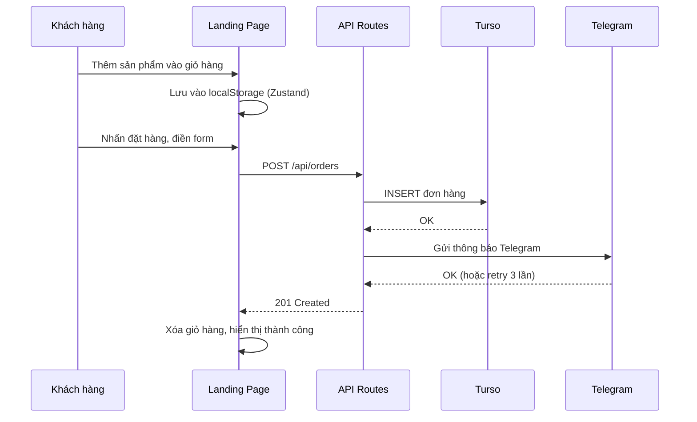
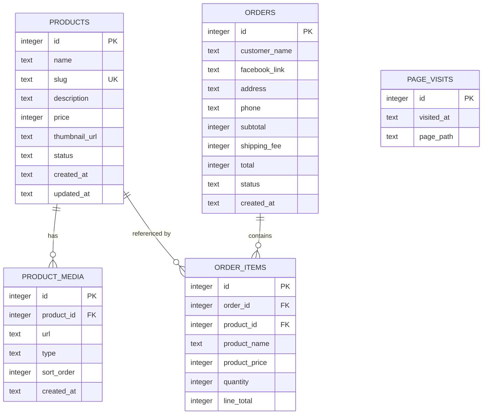

# Tài liệu Thiết kế - Cơm Cháy Bếp Cô Như

## Tổng quan

Hệ thống là một ứng dụng web full-stack gồm hai phần chính:

1. **Landing Page (Storefront)**: Trang bán hàng cho khách hàng — xem sản phẩm, thêm giỏ hàng, đặt hàng, đăng nhập Facebook.
2. **CMS Dashboard**: Trang quản trị cho chủ cửa hàng — quản lý sản phẩm, xem thống kê đơn hàng và lượt truy cập.

### Quyết định công nghệ

| Thành phần | Công nghệ | Lý do |
|---|---|---|
| Framework | Next.js 14 (App Router) | SSR/SSG cho SEO, API routes tích hợp, hỗ trợ tốt cho landing page |
| Styling | Tailwind CSS | Nhanh, responsive, phù hợp phong cách ấm/thân thiện |
| Database | Turso (libSQL) + Drizzle ORM | Theo yêu cầu, Drizzle cho type-safe queries |
| Media Storage | Cloudinary | Theo yêu cầu, SDK tốt cho upload/transform ảnh & video |
| Auth | Facebook OAuth (next-auth) | Theo yêu cầu, NextAuth đơn giản hóa OAuth flow |
| Notifications | Telegram Bot API | Theo yêu cầu, gọi HTTP trực tiếp |
| State (client) | Zustand + localStorage | Nhẹ, đơn giản cho giỏ hàng client-side |
| Deployment | Vercel | Tích hợp tốt với Next.js |

## Kiến trúc

### Sơ đồ kiến trúc tổng quan

```mermaid
graph TB
    subgraph Client
        LP[Landing Page - Next.js SSR/CSR]
        CMS[CMS Dashboard - Next.js CSR]
    end

    subgraph "Next.js API Routes"
        API_PRODUCTS[/api/products]
        API_ORDERS[/api/orders]
        API_UPLOAD[/api/upload]
        API_STATS[/api/stats]
        API_AUTH[/api/auth - NextAuth]
    end

    subgraph "External Services"
        TURSO[(Turso Database)]
        CLOUDINARY[Cloudinary CDN]
        FB[Facebook OAuth]
        TG[Telegram Bot API]
    end

    LP --> API_PRODUCTS
    LP --> API_ORDERS
    LP --> API_AUTH
    CMS --> API_PRODUCTS
    CMS --> API_ORDERS
    CMS --> API_UPLOAD
    CMS --> API_STATS

    API_PRODUCTS --> TURSO
    API_ORDERS --> TURSO
    API_ORDERS --> TG
    API_UPLOAD --> CLOUDINARY
    API_STATS --> TURSO
    API_AUTH --> FB
```

### Luồng đặt hàng




## Thành phần và Giao diện

### 1. Landing Page (Storefront)

#### Cấu trúc trang

| Route | Mô tả | Render |
|---|---|---|
| `/` | Trang chủ — danh sách sản phẩm | SSR |
| `/san-pham/[slug]` | Chi tiết sản phẩm | SSR |
| `/gio-hang` | Giỏ hàng | CSR |
| `/dat-hang` | Form đặt hàng | CSR |

#### Components chính

- `Header`: Logo "Cơm cháy bếp cô Như", navigation, nút giỏ hàng (badge số lượng), nút đăng nhập Facebook / tên user
- `ProductCard`: Hình ảnh đại diện, tên, giá — link đến `/san-pham/[slug]`
- `ProductDetail`: Gallery ảnh/video, mô tả, giá, bộ chọn số lượng, nút thêm giỏ hàng
- `Cart`: Danh sách sản phẩm, số lượng (editable), xóa, tổng tiền, phí vận chuyển, tổng thanh toán
- `OrderForm`: Tên, link Facebook, địa chỉ, số điện thoại — auto-fill từ Facebook session
- `Footer`: Liên kết Zalo, Facebook (mở tab mới), thông tin liên hệ

### 2. CMS Dashboard

#### Cấu trúc trang

| Route | Mô tả |
|---|---|
| `/cms` | Dashboard — thống kê tổng quan |
| `/cms/san-pham` | Danh sách sản phẩm |
| `/cms/san-pham/tao-moi` | Form tạo sản phẩm |
| `/cms/san-pham/[id]/chinh-sua` | Form chỉnh sửa sản phẩm |
| `/cms/don-hang` | Danh sách đơn hàng |

#### Components chính

- `ProductTable`: Bảng sản phẩm — ảnh đại diện, tên, giá, trạng thái, actions (sửa/xóa)
- `ProductForm`: Form tạo/sửa sản phẩm — upload ảnh/video (Cloudinary), mô tả, giá, slug (auto-generate từ tên)
- `StatsOverview`: Tổng lượt truy cập, số đơn hàng theo ngày/tuần/tháng, bộ lọc khoảng thời gian
- `OrderList`: Danh sách đơn hàng với chi tiết

### 3. API Routes

| Endpoint | Method | Mô tả |
|---|---|---|
| `/api/products` | GET | Lấy danh sách sản phẩm (active) |
| `/api/products` | POST | Tạo sản phẩm mới (CMS) |
| `/api/products/[id]` | GET | Lấy chi tiết sản phẩm |
| `/api/products/[id]` | PUT | Cập nhật sản phẩm (CMS) |
| `/api/products/[id]` | DELETE | Xóa sản phẩm (CMS) |
| `/api/products/by-slug/[slug]` | GET | Lấy sản phẩm theo slug |
| `/api/orders` | POST | Tạo đơn hàng mới |
| `/api/orders` | GET | Lấy danh sách đơn hàng (CMS) |
| `/api/upload` | POST | Upload file lên Cloudinary |
| `/api/stats` | GET | Lấy thống kê (CMS) |
| `/api/stats/visit` | POST | Ghi nhận lượt truy cập |
| `/api/auth/[...nextauth]` | * | NextAuth Facebook OAuth |

### 4. Modules nội bộ

#### ShippingCalculator

Hàm thuần (pure function) tính phí vận chuyển:

```typescript
function calculateShippingFee(totalBags: number): number {
  if (totalBags <= 0) return 0;
  if (totalBags === 1) return 30000;
  if (totalBags === 2) return 20000;
  if (totalBags === 3) return 15000;
  return 0; // >= 4 túi: miễn phí
}
```

#### TelegramNotifier

Module gửi thông báo đơn hàng qua Telegram Bot API:

```typescript
interface TelegramNotifier {
  sendOrderNotification(order: Order): Promise<void>;
  // Retry tối đa 3 lần, khoảng cách 5 giây
  // Ghi log lỗi nếu thất bại sau 3 lần
}
```

#### SlugGenerator

Hàm tạo slug từ tên sản phẩm (tiếng Việt → ASCII):

```typescript
function generateSlug(name: string): string;
// "Cơm cháy truyền thống" → "com-chay-truyen-thong"
```

#### PhoneValidator

Xác thực số điện thoại Việt Nam:

```typescript
function isValidVietnamesePhone(phone: string): boolean;
// 10 chữ số, bắt đầu bằng 0
```


## Mô hình Dữ liệu

### Sơ đồ ERD



### Chi tiết bảng

#### products
| Cột | Kiểu | Ràng buộc | Mô tả |
|---|---|---|---|
| id | INTEGER | PK, AUTO | ID sản phẩm |
| name | TEXT | NOT NULL | Tên sản phẩm |
| slug | TEXT | UNIQUE, NOT NULL | Slug URL |
| description | TEXT | | Mô tả sản phẩm |
| price | INTEGER | NOT NULL | Giá (VNĐ, không dùng decimal) |
| thumbnail_url | TEXT | | URL ảnh đại diện (Cloudinary) |
| status | TEXT | DEFAULT 'active' | 'active' hoặc 'inactive' |
| created_at | TEXT | DEFAULT CURRENT_TIMESTAMP | |
| updated_at | TEXT | DEFAULT CURRENT_TIMESTAMP | |

#### product_media
| Cột | Kiểu | Ràng buộc | Mô tả |
|---|---|---|---|
| id | INTEGER | PK, AUTO | |
| product_id | INTEGER | FK → products.id | |
| url | TEXT | NOT NULL | URL Cloudinary |
| type | TEXT | NOT NULL | 'image' hoặc 'video' |
| sort_order | INTEGER | DEFAULT 0 | Thứ tự hiển thị |
| created_at | TEXT | DEFAULT CURRENT_TIMESTAMP | |

#### orders
| Cột | Kiểu | Ràng buộc | Mô tả |
|---|---|---|---|
| id | INTEGER | PK, AUTO | |
| customer_name | TEXT | NOT NULL | Tên khách hàng |
| facebook_link | TEXT | | Link Facebook (tùy chọn) |
| address | TEXT | NOT NULL | Địa chỉ giao hàng |
| phone | TEXT | NOT NULL | Số điện thoại (10 số, bắt đầu 0) |
| subtotal | INTEGER | NOT NULL | Tổng tiền hàng |
| shipping_fee | INTEGER | NOT NULL | Phí vận chuyển |
| total | INTEGER | NOT NULL | Tổng thanh toán |
| status | TEXT | DEFAULT 'mới' | Trạng thái đơn hàng |
| created_at | TEXT | DEFAULT CURRENT_TIMESTAMP | |

#### order_items
| Cột | Kiểu | Ràng buộc | Mô tả |
|---|---|---|---|
| id | INTEGER | PK, AUTO | |
| order_id | INTEGER | FK → orders.id | |
| product_id | INTEGER | FK → products.id | |
| product_name | TEXT | NOT NULL | Snapshot tên SP lúc đặt |
| product_price | INTEGER | NOT NULL | Snapshot giá SP lúc đặt |
| quantity | INTEGER | NOT NULL, > 0 | Số lượng |
| line_total | INTEGER | NOT NULL | = product_price × quantity |

#### page_visits
| Cột | Kiểu | Ràng buộc | Mô tả |
|---|---|---|---|
| id | INTEGER | PK, AUTO | |
| visited_at | TEXT | DEFAULT CURRENT_TIMESTAMP | Thời điểm truy cập |
| page_path | TEXT | NOT NULL | Đường dẫn trang |

### Giỏ hàng (Client-side — localStorage)

```typescript
interface CartItem {
  productId: number;
  productName: string;
  productPrice: number;
  thumbnailUrl: string;
  quantity: number;
}

interface CartState {
  items: CartItem[];
  addItem(product: Product, quantity: number): void;
  updateQuantity(productId: number, quantity: number): void;
  removeItem(productId: number): void;
  clearCart(): void;
  getTotalBags(): number;
  getSubtotal(): number;
  getShippingFee(): number;
  getTotal(): number;
}
```


## Thuộc tính Đúng đắn (Correctness Properties)

*Thuộc tính đúng đắn là một đặc điểm hoặc hành vi phải luôn đúng trong mọi lần thực thi hợp lệ của hệ thống — về cơ bản là một phát biểu hình thức về những gì hệ thống phải làm. Các thuộc tính này là cầu nối giữa đặc tả dễ đọc cho con người và đảm bảo tính đúng đắn có thể kiểm chứng bằng máy.*

### Property 1: Chỉ sản phẩm active được hiển thị

*For any* danh sách sản phẩm trong database với trạng thái hỗn hợp (active/inactive), khi query danh sách sản phẩm cho Landing Page, tất cả sản phẩm trả về đều phải có status = 'active' và không có sản phẩm inactive nào bị bỏ sót.

**Validates: Requirements 1.1**

### Property 2: Chi tiết sản phẩm hiển thị đầy đủ thông tin

*For any* sản phẩm hợp lệ với đầy đủ media (ảnh, video), mô tả và giá, khi render trang chi tiết sản phẩm, output phải chứa tất cả URLs media, mô tả và giá của sản phẩm đó.

**Validates: Requirements 2.1**

### Property 3: Thêm sản phẩm vào giỏ hàng

*For any* sản phẩm hợp lệ và số lượng > 0, khi thêm vào giỏ hàng, giỏ hàng phải chứa sản phẩm đó với đúng số lượng đã chọn, và các sản phẩm khác trong giỏ không bị thay đổi.

**Validates: Requirements 3.1**

### Property 4: Xóa sản phẩm khỏi giỏ hàng

*For any* giỏ hàng có ít nhất 1 sản phẩm, khi xóa một sản phẩm, sản phẩm đó không còn trong giỏ hàng và tất cả sản phẩm còn lại giữ nguyên số lượng.

**Validates: Requirements 3.3**

### Property 5: Giỏ hàng round-trip qua localStorage

*For any* trạng thái giỏ hàng hợp lệ (danh sách sản phẩm với số lượng), khi serialize vào localStorage rồi deserialize lại, trạng thái giỏ hàng phải giống hệt ban đầu.

**Validates: Requirements 3.4**

### Property 6: Tổng tiền giỏ hàng luôn đúng

*For any* giỏ hàng với danh sách sản phẩm và số lượng bất kỳ, tổng tiền hàng (subtotal) phải bằng tổng của (giá × số lượng) mỗi sản phẩm, phí vận chuyển phải bằng calculateShippingFee(tổng số túi), và tổng thanh toán phải bằng subtotal + shipping_fee.

**Validates: Requirements 3.2, 3.5**

### Property 7: Miễn phí vận chuyển từ 4 túi trở lên

*For any* số nguyên n ≥ 4, calculateShippingFee(n) phải trả về 0.

**Validates: Requirements 4.4**

### Property 8: Xác thực số điện thoại Việt Nam

*For any* chuỗi ký tự, isValidVietnamesePhone trả về true khi và chỉ khi chuỗi có đúng 10 chữ số và bắt đầu bằng '0'.

**Validates: Requirements 6.4**

### Property 9: Validate trường bắt buộc form đặt hàng

*For any* dữ liệu form đặt hàng mà thiếu ít nhất một trong các trường bắt buộc (tên, địa chỉ, số điện thoại), form validation phải từ chối và không cho phép gửi đơn hàng.

**Validates: Requirements 6.3**

### Property 10: Tin nhắn Telegram chứa đầy đủ thông tin đơn hàng

*For any* đơn hàng hợp lệ, tin nhắn Telegram được format phải chứa: tên khách hàng, số điện thoại, địa chỉ, danh sách sản phẩm với số lượng, tổng tiền hàng, phí vận chuyển và tổng thanh toán.

**Validates: Requirements 7.2**

### Property 11: Slug generation tạo slug hợp lệ

*For any* tên sản phẩm tiếng Việt hợp lệ (không rỗng), generateSlug phải trả về chuỗi chỉ chứa ký tự lowercase ASCII, chữ số và dấu gạch ngang, không bắt đầu hoặc kết thúc bằng dấu gạch ngang, và không chứa dấu gạch ngang liên tiếp.

**Validates: Requirements 8.8**

### Property 12: Lọc đơn hàng theo khoảng thời gian

*For any* danh sách đơn hàng với ngày tạo ngẫu nhiên và khoảng thời gian (startDate, endDate) hợp lệ, kết quả lọc phải chỉ chứa các đơn hàng có created_at nằm trong khoảng [startDate, endDate] và không bỏ sót đơn hàng nào trong khoảng đó.

**Validates: Requirements 9.2, 9.3**


## Xử lý Lỗi

| Tình huống | Xử lý | Hiển thị |
|---|---|---|
| Slug sản phẩm không tồn tại | Return 404 | Trang "Sản phẩm không tồn tại" |
| Đăng nhập Facebook thất bại | Catch OAuth error | "Đăng nhập Facebook thất bại, vui lòng thử lại" |
| Form đặt hàng thiếu trường bắt buộc | Client-side validation | Highlight trường lỗi + thông báo |
| Số điện thoại không hợp lệ | Client-side validation | "Số điện thoại không hợp lệ" |
| Tạo đơn hàng thất bại (DB error) | Return 500, giữ giỏ hàng | "Đặt hàng thất bại, vui lòng thử lại" |
| Gửi Telegram thất bại | Retry 3 lần, 5s delay, log error | Không ảnh hưởng response cho khách |
| Upload file quá dung lượng | Client-side check trước upload | "File vượt quá dung lượng cho phép (tối đa X MB)" |
| Slug trùng lặp | DB unique constraint | "Slug đã tồn tại, vui lòng chọn slug khác" |
| Cloudinary upload thất bại | Return error | "Tải file thất bại, vui lòng thử lại" |
| Database connection error | Return 500 | "Lỗi hệ thống, vui lòng thử lại sau" |

### Nguyên tắc xử lý lỗi

1. **Telegram notification là fire-and-forget**: Lỗi gửi Telegram không ảnh hưởng đến response đặt hàng cho khách. Đơn hàng vẫn được tạo thành công.
2. **Client-side validation trước**: Validate form ở client trước khi gửi API để giảm tải server.
3. **Server-side validation luôn có**: Không tin tưởng client-side validation, luôn validate lại ở server.
4. **Giữ nguyên dữ liệu khi lỗi**: Khi đặt hàng thất bại, giỏ hàng và form data được giữ nguyên.

## Chiến lược Testing

### Property-Based Testing

Sử dụng **fast-check** (thư viện PBT cho TypeScript/JavaScript).

Cấu hình: Mỗi property test chạy tối thiểu **100 iterations**.

Các property tests (tham chiếu từ phần Correctness Properties):

| Property | Module | Tag |
|---|---|---|
| Property 1: Active products | Product query | Feature: com-chay-landing-page, Property 1: Chỉ sản phẩm active được hiển thị |
| Property 2: Product detail | Product rendering | Feature: com-chay-landing-page, Property 2: Chi tiết sản phẩm hiển thị đầy đủ |
| Property 3: Cart add | Cart store | Feature: com-chay-landing-page, Property 3: Thêm sản phẩm vào giỏ hàng |
| Property 4: Cart remove | Cart store | Feature: com-chay-landing-page, Property 4: Xóa sản phẩm khỏi giỏ hàng |
| Property 5: Cart round-trip | Cart persistence | Feature: com-chay-landing-page, Property 5: Giỏ hàng round-trip localStorage |
| Property 6: Cart totals | Cart calculations | Feature: com-chay-landing-page, Property 6: Tổng tiền giỏ hàng luôn đúng |
| Property 7: Free shipping | ShippingCalculator | Feature: com-chay-landing-page, Property 7: Miễn phí vận chuyển từ 4 túi |
| Property 8: Phone validation | PhoneValidator | Feature: com-chay-landing-page, Property 8: Xác thực SĐT Việt Nam |
| Property 9: Required fields | OrderForm validation | Feature: com-chay-landing-page, Property 9: Validate trường bắt buộc |
| Property 10: Telegram message | TelegramNotifier | Feature: com-chay-landing-page, Property 10: Tin nhắn Telegram đầy đủ |
| Property 11: Slug generation | SlugGenerator | Feature: com-chay-landing-page, Property 11: Slug generation hợp lệ |
| Property 12: Date range filter | Stats query | Feature: com-chay-landing-page, Property 12: Lọc đơn hàng theo thời gian |

### Unit Tests (Example-based)

- Shipping fee: test cụ thể cho 1, 2, 3 túi (30k, 20k, 15k) và 0 túi (0đ)
- 404 page cho slug không tồn tại
- Auto-fill form từ Facebook session
- Header/Footer chứa đúng elements
- Slug trùng lặp hiển thị lỗi
- File upload quá dung lượng hiển thị lỗi

### Integration Tests

- Facebook OAuth flow (mock)
- Tạo đơn hàng → lưu DB → gửi Telegram (mock external APIs)
- Upload Cloudinary (mock)
- Telegram retry logic (mock failures)
- CRUD sản phẩm qua API
- Ghi nhận và query lượt truy cập

### Công cụ

- **Vitest**: Test runner
- **fast-check**: Property-based testing
- **Testing Library**: Component testing
- **MSW (Mock Service Worker)**: Mock API calls

